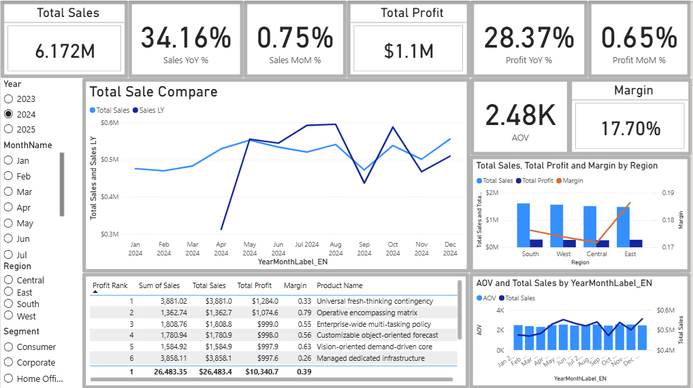

# Sales Performance Dashboard (Apr 2023 – Apr 2025)

A two-page Power BI dashboard to monitor sales performance and identify key drivers across time, region, segment, and product.

## Case Study (PDF)
- [Download / View the 1-slide case study](docs/Project01_SalesDashboard.pdf)

## Dashboard Preview

**Overview**

**Deep Dive**

**Sales vs Last Year**

**Top 10 Products (by Profit Rank)**

---

## Project Highlights
- Built a 2-page Power BI dashboard (Overview + Deep Dive) for Apr 2023–Apr 2025 (partial 2025)
- Modeled a Date table and standardized KPIs: Sales, Profit, Margin, Orders, Customers, AOV
- Implemented YoY/MoM comparisons and Sales vs Last Year trend using DAX time intelligence
- Created Profit-based Top 10 product ranking to guide scaling decisions
- Documented measures and assumptions (partial-month coverage)

## Business Goal
Build an end-to-end monitoring dashboard that answers:
- How are Sales, Profit, and Margin performing over time?
- Which regions/segments/products drive performance?
- How does performance compare YoY and MoM?

## Dataset
- File: `data/sale_data.csv`
- Granularity: order-level
- Coverage: Apr 2023 → Apr 2025 (**partial 2025**)

## Core KPIs (Overall)
- Total Sales: **$12.507M**
- Total Profit: **$2.240M**
- Margin: **17.91%**
- Orders: **~5K**
- Customers: **~4K**
- AOV: **~$2.50K**

## Data Modeling (Power BI)
- Created a dedicated Date table and related it to the fact table by Order Date
- Standardized time axis using Year-Month labels to avoid mixed-year month sorting
- Forced English month labels (to avoid locale output like “thg4/thg5”)

## DAX Measures
All measures used in this project are documented here:
- `dax/measures.txt`

Key measures include:
- Total Sales, Total Profit, Total Orders, Total Customers, Margin, AOV
- YoY and MoM comparisons using time intelligence patterns

## Insight 1 - Growth is real, but decision quality depends on normalizing time

Evidence: Sales YoY ~ +90.7%, Profit YoY ~ +87.0% (Deep Dive).

Mechanism: YoY uplift can be overstated/understated if the latest period contains partial months - the comparison baseline is not like-for-like.

Bottleneck: performance narrative becomes fragile when stakeholders challenge comparability.

Focus: report YoY at monthly granularity and exclude/normalize partial month (sales/day or cut-off aligned) to make the story audit-proof.

## Insight 2 - Region is not the constraint; margin + product mix are the levers

Evidence: Sales by Region is relatively balanced (no single “hero region”). Margin is ~17.9% overall.

Mechanism: when geography is evenly distributed, variance in outcomes typically comes from mix (which products/segments sell) and economics (margin), not location.

Bottleneck: scaling sales without controlling mix can dilute margin.

Focus: manage growth through profit-led portfolio actions - protect margin via thresholds, review low-margin high-volume items, scale profit-leading products.

## Insight 3 - Segment diversification reduces dependency risk, but blurs where to act

Evidence: Segment split ~ one-third each (Corporate/Home Office/Consumer).

Mechanism: balanced mix lowers concentration risk, but makes “where to invest” unclear unless you connect segment performance to profitability and product drivers.

Bottleneck: without a driver view, teams chase volume instead of value.

Focus: add a driver layer: segment x product profitability and contribution - prioritize initiatives where profit contribution is highest, not just sales.

## Key action

Make YoY comparison audit-proof (normalize partial month).

Shift from volume-led to profit-led growth (portfolio + margin guardrails).

Add driver cut (Segment x Product contribution) to pinpoint where to invest.

## Recommendations
- Set margin guardrails and monitor margin monthly by Region/Segment
- Manage the product portfolio using Profit-based Top 10 ranking
- Treat partial months carefully (normalize by day or exclude partial month for fair comparisons)

